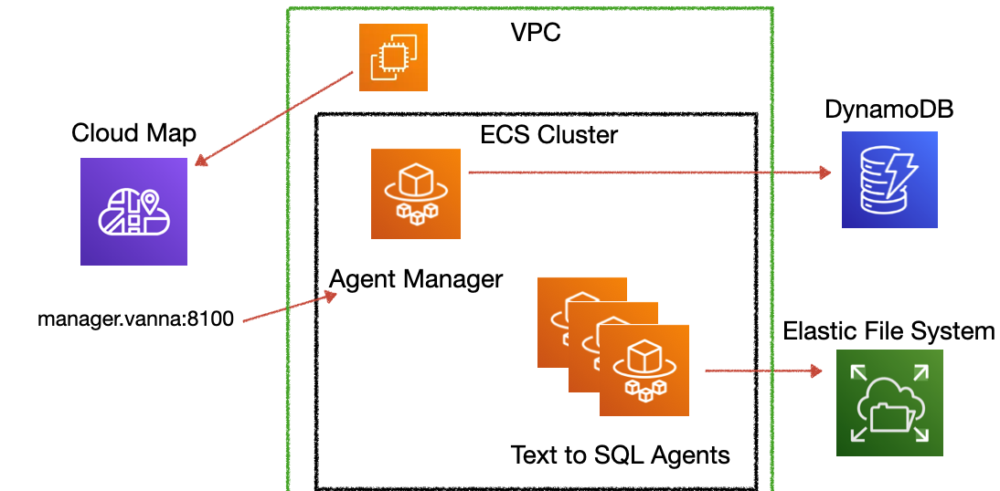

# Vanna Multi-Tenant

Multi-tenant SQL AI assistant service built on [Vanna](https://github.com/vanna-ai/vanna). Supports both single Docker and AWS ECS deployment modes.

多租戶的 Vanna AI SQL 助手服務，支援單一 Docker 和 AWS ECS 兩種部署模式。

## Features

- **Multi-Agent Management**: Dynamically create, delete, start, and stop agents
- **Two Deployment Modes**:
  - Single Docker (multiprocessing)
  - AWS ECS (microservices)
- **Connection Pooling**: PostgreSQL connection pool for high concurrency
- **Auto Schema Detection**: Automatically generate system prompts from database schema

## Architecture

### Single Docker Mode


### ECS Mode



## Quick Start

### Option 1: Single Docker (Local Development)

```bash
# 1. Clone and setup
git clone https://github.com/yourname/vanna-multi-tenant.git
cd vanna-multi-tenant

# 2. Configure environment
cp config/.env.example config/.env
# Edit config/.env with your Azure OpenAI and PostgreSQL settings

# 3. Start service
cd docker
docker-compose up -d

# 4. Open management UI
open http://localhost:8100/admin/agents
```

### Option 2: AWS ECS (Production)

See [ECS Deployment Guide](docs/DEPLOYMENT.md) for detailed instructions.

## Project Structure

```
vanna-multi-tenant/
├── src/                          # Source code
│   ├── main_multi_agent.py       # Single Docker version
│   ├── main_manager_ecs.py       # ECS Manager service
│   ├── main_agent_ecs.py         # ECS Agent service
│   ├── db/                       # Database utilities
│   │   └── postgres_pooled.py    # Connection pool
│   ├── templates.py              # HTML templates
│   └── custom_tools.py           # Custom tools
│
├── docker/                       # Docker files
│   ├── Dockerfile                # Single Docker
│   ├── Dockerfile.manager        # ECS Manager
│   ├── Dockerfile.agent          # ECS Agent
│   └── docker-compose.yaml
│
├── deploy/ecs/                   # ECS deployment
│   ├── task-definition-*.json
│   └── push-*.sh
│
├── config/                       # Configuration
│   ├── .env.example
│   └── .env.ecs.example
│
└── requirements.txt
```

## Environment Variables

### Required

```bash
# Azure OpenAI
AZURE_OPENAI_API_KEY=your_key
AZURE_OPENAI_ENDPOINT=https://your-endpoint.openai.azure.com/
AZURE_OPENAI_API_VERSION=2025-01-01-preview
AZURE_OPENAI_DEPLOYMENT_NAME=gpt-4
```

### ECS Only

```bash
AWS_DEFAULT_REGION=ap-northeast-1
DYNAMODB_TABLE_NAME=vanna-agents
ECS_CLUSTER_NAME=vanna-cluster
SUBNET_IDS=subnet-xxx
SECURITY_GROUP_IDS=sg-xxx
```

## API Endpoints

### Manager API (Port 8100)

| Method | Path | Description |
|--------|------|-------------|
| GET | `/admin/agents` | Management UI |
| GET | `/api/agents` | List all agents |
| POST | `/api/agents` | Create new agent |
| DELETE | `/api/agents/{id}` | Delete agent |
| POST | `/api/agents/{id}/start` | Start agent |
| POST | `/api/agents/{id}/stop` | Stop agent |

### Agent API (Port 8101)

| Method | Path | Description |
|--------|------|-------------|
| POST | `/api/vanna/v2/chat_sse` | Chat API (SSE) |
| GET | `/health` | Health check |

### ECS Proxy (via Manager)

```bash
# All agent requests can be proxied through Manager
GET /agent/{agent_id}/api/vanna/v2/chat_sse
```

## Credits

This project is built on top of [Vanna](https://github.com/vanna-ai/vanna), an MIT-licensed open-source Python RAG framework for SQL generation.

## License

MIT
